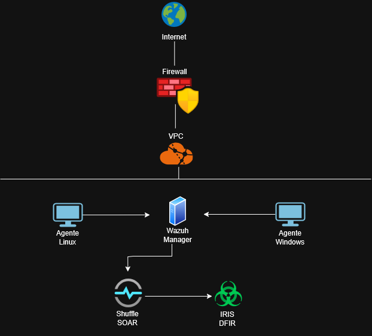
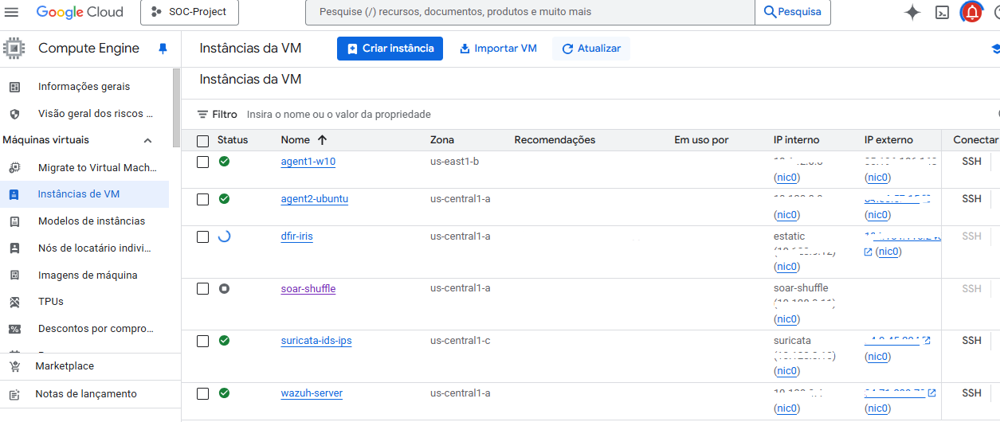
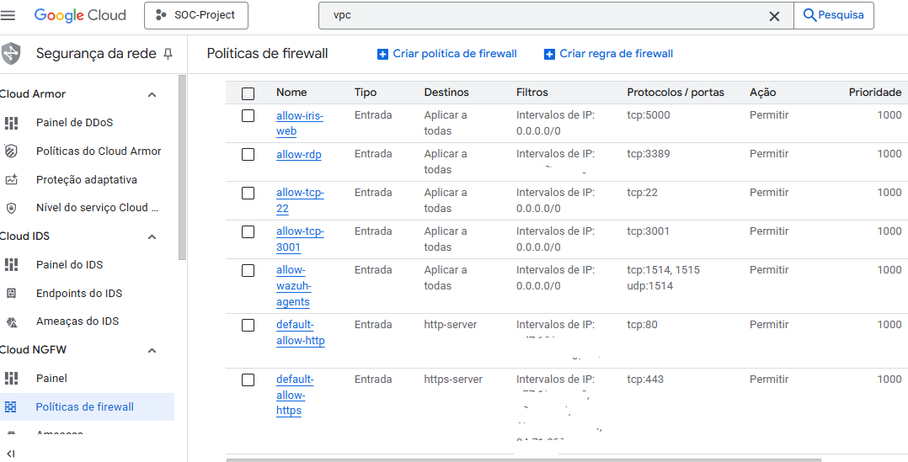

# Arquitetura do Laboratório SOC na Google Cloud Platform (GCP)

>Visão geral da infraestrutura e dos componentes que compõem o projeto.

## Google Cloud Platform (GCP)

A Google Cloud Platform (GCP) é a poderosa plataforma de serviços em nuvem da Google, que oferece infraestrutura escalável, flexível, segura e de fácil acesso para o desenvolvimento, implantação e gerenciamento de aplicações e serviços. A escolha da GCP para este laboratório se deu principalmente pela praticidade e acessibilidade que a plataforma oferece. A GCP disponibiliza um crédito de aproximadamente U$300 para novos usuários, válidos por 90 dias, permitindo a experimentação de diversos serviços sem custos.

## Por que escolher a GCP para o laboratório SOC

- **Acessibilidade:** Como havia citado, a GCP se destaca como uma excelente escolha para quem deseja desenvolver projetos como esse, especialmente pela acessibilidade que oferece. A plataforma possuí uma política bastante generosa com novos usuários, oferecendo créditos gratuitos que podem ser utilizados por até 90 dias, o que permite explorar diversos serviços sem custos, sendo ideal para quem deseja aprender, testar e construir projetos práticos.
- **Flexibilidade:** Oferece uma ampla gama de serviços gerenciados que facilitam a criação, personalização e manutenção do ambiente.
- **Escalabilidade:** Permite o ajuste dinâmico de recursos conforme a demanda, permitindo simular os mais diversos cenários e ambientes.
- **Segurança:** Disponibiliza ferramentas nativas para controle de acesso, monitoramento contínuo e proteção da infraestrutura. 

## Topologia da Arquitetura

*Figura 1 – Diagrama simplificado da arquitetura do laboratório SOC na GCP.*

## Infraestrutura usada

- **Máquinas Virtuais (VMs):** instancias que hospedam o Wazuh Manager, os agentes (Windows e Linux), o Shuffle SOAR e o IRIS DFIR.
- **Redes Virtuais (VPC):** configuradas para garantir isolamento, controle do tráfego e maior segurança na comunicação entre as VMs.
- **Firewalls:** regras aplicadas para proteger as VMs, limitando o acesso às portas essenciais e prevenindo tráfego não autorizado.
- **Storage:** armazenamento persistente de logs, configurações e dados gerados pelos serviços.

## Instâncias (Máquinas Virtuais)

*Figura 2 – Listagem das VMs utilizadas no laboratório SOC na GCP.*

## Descrição das Máquinas Virtuais

As principais VMs criadas para o laboratório são:

- **Wazuh Manager:** responsável pela coleta, análise e correlação de eventos de segurança, funcionando como o núcleo do SIEM.
- **Agente Linux:** máquina que simula um endpoint Linux monitorado pelo Wazuh.
- **Agente Windows:** endpoint Windows configurado para envio de logs e alertas ao Wazuh.
- **Shuffle SOAR:** plataforma para automatização de respostas a incidentes e orquestração de ações.
- **IRIS DFIR:** ferramenta para análise forense e resposta a incidentes digitais.

## Segurança da Infraestrutura

Para garantir a segurança da infraestrutura na GCP, foram aplicadas as seguintes medidas:

- Configuração de regras de firewall que restringem o acesso apenas aos serviços e portas essenciais para o funcionamento do laboratório.
- Utilização de contas e permissões baseadas em papéis (IAM), limitando os privilégios de cada recurso.
- Monitoramento inicial do tráfego e dos logs para detectar possíveis anomalias ou acessos suspeitos.

## Principais regras de firewall - GCP

*Figura 3 – Regras de firewall personalizadas essenciais para a comunicação entre as VMs .*

---

Esta arquitetura fornece uma base realista para o desenvolvimento de habilidades práticas envolvendo segurança, infraestrutura e nuvem, garantindo sempre as melhores práticas de infraestrutura segura. 