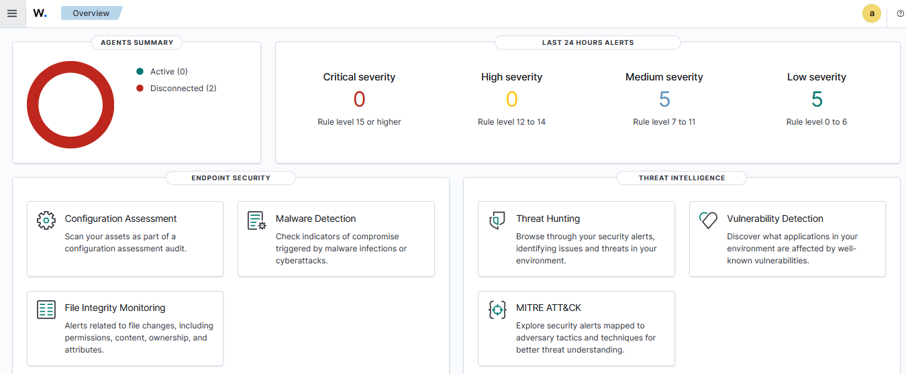

## Visão Geral

Neste etapa, vou descrever como eu realizei a instalação de todos os componentes do laboratório SOC, incluíndo:

- O Wazuh Manager (SIEM)
- Os dois agentes (um Linux e um Windows)
- A ferramenta IRIS (DFIR)
- O Shuffle (SOAR)

Todas as instalações foram feitas em máquinas virtuais na Google Cloud Platform (GCP), justamente para não precisar sobrecarregar os recursos do meu computador.

---

## Instâncias criadas na GCP

Para montar esse ambiente, eu criei as seguintes instâncias:

#### 1- wazuh-manager | Ubuntu 22.04 LTS | SIEM (Wazuh) | 2vCPU / 4 GB / 50 GB
#### 2- agent-linux | Ubuntu 22.04 LTS | Agente Linux | 1vCPU / 2 GB / 20 GB
#### 3- agent-w10 | Windows 10 | Agente Windows | 2vCPU / 4 GB / 20 GB
#### 4- dfir-iris | Ubuntu 22.04 LTS | DFIR (IRIS) | 2vCPU / 4 GB / 30 GB

Deixei os IPs externos estáticos na GCP para evitar mudanças durante os testes e integrações.

---

## Instalação do Wazuh Manager

A primeira etapa, foi a instalçao do Wazuh Manager. Para isso, usei uma instância Ubuntu. Segui o método oficial de instalação all-in-one, que inclui o Manager, o Dashboard e o Elasticsearch.

Os comandos que utilizei foram:

```bash
curl -sO https://packages.wazuh.com/4.12/wazuh-install.sh && sudo bash ./wazuh-install.sh -a
```
Depois de concluiída a instalção, fiz algumas configurações no arquivo *ossec.conf*, e mais pra frente realizei as alterações necessárias para a integração com o IRIS e Shuffle.

A partir de agora, temos acesso ao Dashboard web do Wazuh, garantindo que o Manageres tivesse recebendo eventos e funcionando normalmente, para isso, basta copiar o IP da VM, colar na URL do navegador, e logar com as credenciais que foram geradas pelo próprio Wazuh na instalação.

## Interface gráfica do Wazuh


*Figura 4 – Interface gráfica do Wazuh, acessada com o IP da VM diretamente na URL do navegador utilizando as credenciais geradas pelo Wazuh .*

## Instalação dos Agentes
#### Agente Linux

No agente Linux também baseado no Ubuntu, fiz a instalação do Wazuh Agent com o seguindo procedimento:

```bash
curl -sO https://packages.wazuh.com/4.7/wazuh-agent.sh
sudo bash wazuh-agent.sh
```
Depois da instalação, configurei o IP do Manager dentro do arquivo /var/ossec/etc/ossec.conf do agent, e utilizei o comando abaixo no Manager para gerar a chave de registro:

```bash
/var/ossec/bin/manage_agents
```
Após registrar a chave no agente, iniciei o serviço e validei a comunicação no Dashboard.

#### Agente Windows

No agente Windows, fiz o download do instalador .msi diretamente do site oficial do Wazuh.

Durante o processo de instalação:

- Defini o IP do Manager
- Completei a configuração
- Iniciei o serviço manualmente
- Por fim, confirmei que o agente estava aparecendo como conectado no Dashboard do Wazuh


