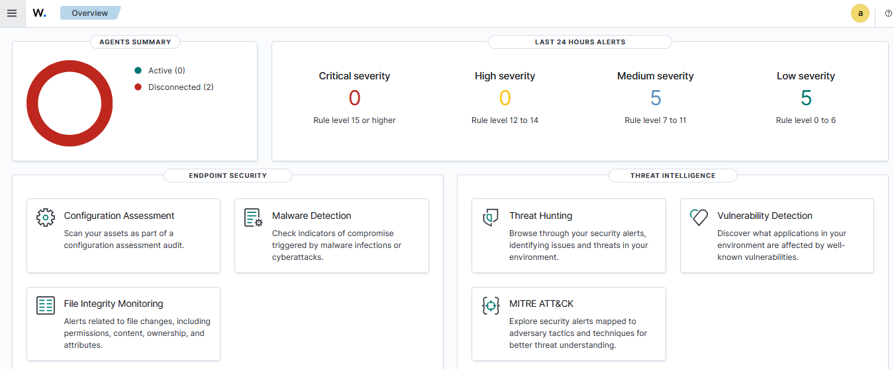
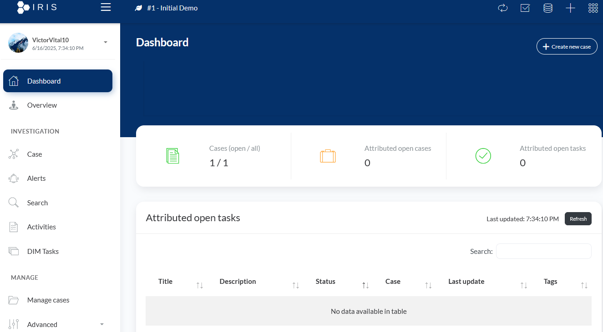

## Visão Geral

Nesta etapa, vou descrever como eu realizei a instalação de todos os componentes do laboratório SOC, incluindo:

- O Wazuh Manager (SIEM)
- Os dois agentes (um Linux e um Windows)
- A ferramenta IRIS (DFIR)
- O Shuffle (SOAR)

Todas as instalações foram feitas em máquinas virtuais na Google Cloud Platform (GCP), justamente para não precisar sobrecarregar os recursos do meu computador.

---

## Instâncias criadas na GCP

Para montar esse ambiente, eu criei as seguintes instâncias:

#### 1 - wazuh-manager | Ubuntu 22.04 LTS | SIEM (Wazuh) | 2vCPU / 4 GB / 50 GB
#### 2 - agent-linux | Ubuntu 22.04 LTS | Agente Linux | 1vCPU / 2 GB / 20 GB
#### 3 - agent-w10 | Windows 10 | Agente Windows | 2vCPU / 4 GB / 20 GB
#### 4 - dfir-iris | Ubuntu 22.04 LTS | DFIR (IRIS) | 2vCPU / 4 GB / 30 GB

Deixei os IPs externos estáticos na GCP para evitar mudanças durante os testes e integrações.

---

## Instalação do Wazuh Manager

A primeira etapa foi a instalação do Wazuh Manager. Para isso, usei uma instância Ubuntu. Segui o método oficial de instalação all-in-one, que inclui o Manager, o Dashboard e o Elasticsearch.

Os comandos que utilizei foram:

```bash
curl -sO https://packages.wazuh.com/4.12/wazuh-install.sh && sudo bash ./wazuh-install.sh -a
```
Depois de concluída a instalação, fiz algumas configurações no arquivo *ossec.conf* e, mais para frente, realizei as alterações necessárias para a integração com o IRIS e Shuffle.

A partir de agora, temos acesso ao Dashboard web do Wazuh, garantindo que o Manager estivesse recebendo eventos e funcionando normalmente, para isso, basta copiar o IP da VM, colar na barra do navegador e fazer login com as credenciais que foram geradas pelo próprio Wazuh durante a instalação.

## Página inicial do Wazuh


*Figura 4 – Interface gráfica do Wazuh, acessada com o IP da VM diretamente na URL do navegador utilizando as credenciais geradas pelo Wazuh.*

## Instalação dos Agentes
#### Agente Linux

No agente Linux, também baseado no Ubuntu, fiz a instalação do Wazuh Agent com o seguinte procedimento:

```bash
curl -sO https://packages.wazuh.com/4.7/wazuh-agent.sh
sudo bash wazuh-agent.sh
```
Depois da instalação, configurei o IP do Manager dentro do arquivo /var/ossec/etc/ossec.conf do agente e utilizei o comando abaixo no Manager para gerar a chave de registro:

```bash
/var/ossec/bin/manage_agents
```
Após registrar a chave no agente, iniciei o serviço e validei a comunicação no Dashboard.

#### Agente Windows

No agente Windows, fiz o download do instalador .msi diretamente do site oficial do Wazuh.

Durante o processo de instalação:

- Defini o IP do Manager
- Completei a configuração
- Iniciei o serviço manualmente
- Por fim, confirmei que o agente estava aparecendo como conectado no Dashboard do Wazuh

## Instalação do IRIS (DFIR)
A instalação do IRIS foi uma das partes que mais curti, porque envolveu trabalhar com Docker e também fazer integrações futuras via Webhook.

Utilizei mais uma instância Ubuntu na GCP para isso.

O processo foi o seguinte:

#### 1 - Clonar o repositório oficial do IRIS:

``` bash
git clone https://github.com/dfir-iris/iris.git
cd iris/docker
```
#### 2 - Subir os containers com Docker Compose:

``` bash
sudo docker compose up -d
```
Logo após isso, o IRIS já estava disponível via HTTPS na porta 443.

No primeiro acesso, realizei o login com as credenciais padrão, mas recomendo fortemente alterar essa senha para reforçar a segurança.

## Página inicial do IRIS 


Nesse momento, é necessário fazer o cadastro de um novo cliente (customer) dentro da plataforma do IRIS.

O conceito de cliente (customer) dentro do IRIS tem um papel fundamental: ele representa a organização, entidade ou unidade que está sendo monitorada e para a qual as investigações serão realizadas.

Também é necessário gerar um token de autenticação na aba 'Access Control', que será usado para fazer a integração com o Wazuh.

## Considerações finais sobre a instalação

Durante o processo de implementação do SOC Lab, um dos pontos que mais exigiu minha atenção foi a configuração das regras de firewall na GCP.

Cada serviço que compõe o ambiente (Wazuh, IRIS, agentes, SOAR, etc.) utiliza portas específicas para comunicação, e a falta de um mapeamento preciso dessas portas acabou gerando uma série de erros de conexão que consumiram um tempo considerável para diagnosticar e resolver.

Abaixo estão algumas portas essenciais para o funcionamento do SOC:
- Porta 22 (SSH)
- Porta 443 (HTTPS)
- Portas 1514/UDP e 1515/TCP (usada para comunicação dos agentes com o Wazuh)
- Porta 5000/TCP (essencial para integração do IRIS com as demais ferramentas)

Hoje vejo que esse processo, apesar de ter consumido tempo, foi extremamente valioso para consolidar meu entendimento sobre a interdependência entre serviços em um SOC moderno.


