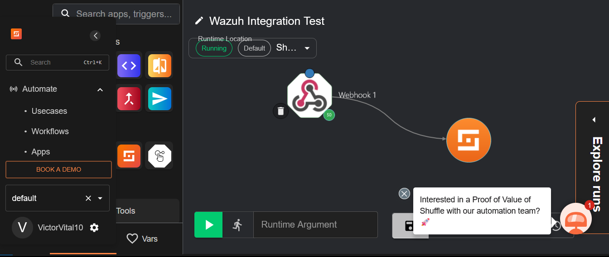

# Configuração dos Componentes do SOC LAB

> Nesta etapa, irei apresentar de forma detalhada como foi realizada a configuração de cada um dos componentes do SOC Lab. O foco aqui é descrever os principais ajustes feitos no Wazuh Manager, o processo de registro dos agentes, as integrações com o IRIS e o Shuffle, além das configurações de firewall e das medidas de segurança aplicadas.

#### 1 - Configuração Inicial do Wazuh Manager
A configuração do Wazuh Manager foi o primeiro passo para estruturar a base de monitoramento do SOC Lab. Realizei os seguintes ajustes:
- Ajuste de regras de alerta no arquivo 'ossec.conf'
- Criação de regras customizadas (Opcional)
- Configuração de saída JSON para integrações
- Habilitação de módulos específicos (se aplicável)
- Definição de níveis mínimos de alerta, como na imagem abaixo:

### Tag *Alerts* configurada com o level 3

 

*Imagem 7 – Trecho do arquivo ossec.conf com a tag alerts configurada com o level 3.*


#### 2 - Registro e Autorização de Agentes
Garantir a comunicação segura entre Wazuh Manager e os Agentes (Linux e Windows) é uma etapa crucial.
- Adição dos agentes ao manager
- Geração e importação das chaves de registro
- Ajustes feitos nos agentes para apontar para o IP do Manager, garantindo que os logs fossem enviados corretamente
- Validação da comunicação

### Dashboard do Wazuh com os Agentes


*Imagem 8 – Wazuh Dashboard mostrando os dois agentes ativos e conectados.*

#### 3 - Integração Wazuh - IRIS
Para integrar o SIEM Wazuh com a ferramenta DFIR IRIS, seguimos o processo clássico de integração via Webhook e autenticaçãp por token.
- Geração do token no IRIS (token de autenticação)
- Configuração do Webhook no Wazuh nos arquivos 'ossec.conf' e 'integration.conf', exemplo:
``` bash
{
  "integration": "custom-webhook",
  "hook_url": "https://<IP_DO_IRIS>/alerts/add",
  "headers": {
    "Authorization": "Bearer <TOKEN_GERADO_NO_IRIS>"
  }
}
```
- Ajuste do nível mínimo de alerta para disparo
- Teste de integração (exemplo: uso de 'curl' ou execução de comando sudo em um agente)

### Aba *Access Control* com Token gerado no IRIS


*Imagem 9 – Ilustração do Token gerado na interface do IRIS, posteriormente usado na integração com o Wazuh.*

#### 4 - Integração Wazuh - Shuffle (SOAR)
A comunicação entre o Wazuh e o Shuffle foi feita também via Webhook, permitindo que alertas gerados no Wazuh fossem recebidos no Shuffle para orquestração de respostas automatizadas:

- Configuração de um endpoint de Webhook no Shuffle

- Criação de workflows de resposta baseados em eventos (por exemplo, alertas de brute-force ou uso de sudo)

- Envio de alertas JSON via integração Webhook do Wazuh apontando para o Shuffle

- Validação com playbooks simples (como notificações e marcação de eventos)

### Workflow no Shuffle


*Imagem 10 – Workflow criado no Shuffle.*

Essa integração foi essencial para automatizar ações a partir dos alertas detectados pelo SIEM.


#### 5 - Configuração de regras de Firewall (GCP)
Garantir o controle de tráfego entre as VMs foi fundamental para a segurança e o funcionamento correto do SOC Lab. As regras de firewall foram configuradas diretamente na Google Cloud Platform (GCP), com foco no princípio do menor privilégio (permitir apenas o necessário)

### Regras de Firewall criadas na GCP


*Imagem 11 – Todas as regras de firewall que precisam ser configuradas para comunicação entre as instâncias.*

 Algumas regras de firewall que são essenciais para o funcionamento do projeto:
- Porta 1514 | TCP/UDP | Wazuh Manager (OSSEC) | Recebe dados dos agentes
- Porta 55000 | TCP | Wazuh Agent | Comunicação com os agentes
- Porta 443 | TCP | IRIS | Interface web segura (HTTPS)
- Porta 5601 | TCP | Shuffle SOAR | Dashboard de automação
- Porta 22 | TCP | Todas as VMs | Acesso SSH para administração

#### 5 - Considerações de Segurança
Seguindo as boas práticas tradicionais de segurança, adotei as seguintes medidas:
- Todas as senhas padrão foram alteradas imediatamente após a instalação para evitar vulnerabilidades óbvias e ataques automatizados
- Usuários e senhas do IRIS e do Wazuh Manager foram configurados com credenciais fortes e armazenadas em um gerenciador de senhas seguro.
- Regras de firewall que permitem acesso somente a partir de IPs específicos da rede de administração, minimizando a exposição dos serviços na internet pública.

#### 6 - Exemplos de Arquivos de Configuração
Trechos relevantes do arquivo 'ossec.conf':

``` bash
<ossec_conf>
    <remote>
        <connection>secure</connection>
        <port>1514</port>
        <protocol>udp</protocol>
        <queue_size>131072</queue_size>
    </remote>
<!-- Integração do IRIS -->  
    <integration>
        <name>[NOME_DO_ARQUIVO]</name>
        <hook_url>[IP_DO_IRIS]</hook_url>
        <level>[NÍVEL]</level>
        <api_key>[CHAVE_API]</api_key>
        <alert_format>json</alert_format>
    </integration>
    <alerts>
        <log_alert_level>3</log_alert_level>
    </alerts>
</ossec_conf>
```
Exemplo de regra personalizada no arquivo 'custom_rules.xml':

``` bash
<rule id="100001" level="10">
  <if_sid>18107</if_sid>
  <field name="command">sudo</field>
  <description>Comando sudo executado</description>
</rule>
```

Exemplo de payload enviado via Webhook para o IRIS:
``` bash 
{
  "rule": {
    "level": 10,
    "description": "Comando sudo executado"
  },
  "agent": {
    "name": "agent-linux",
    "id": "001"
  },
  "timestamp": "2025-06-16T19:30:00Z"
}
```

### Conclusão dessa Etapa
Com todas essas configurações concluídas, estabelecemos um ambiente de SOC funcional, seguro e com boa capacidade de integração entre os principais componentes: Wazuh, IRIS, Shuffle SOAR e os Agentes de Monitoramento.