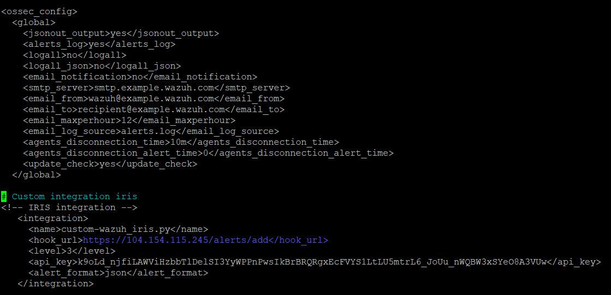

## Visão Geral

> Nesta etapa, o foco principal foi validar o funcionamento de cada um dos componentes do laboratório SOC após suas respectivas instalações e configurações.

O objetivo dos testes foi garantir que todos os serviços estão se comunicando corretamente, que os agentes estão enviando eventos, que o SIEM está processando os alertas e que as integrações com as demais ferramentas (como o IRIS e o Shuffle) estão funcionando conforme o esperado.

---

## Testes de Conectividade

O primeiro passo antes de iniciar os testes de funcionalidades foi validar a conectividade entre todas as VMs na GCP.

Realizei os seguintes procedimentos:

- Teste de **ping** entre os servidores para garantir comunicação de rede
- Teste de acesso remoto via **SSH** (para instâncias Linux) e **RDP** (para a instância Windows).
- Validação de acesso às interfaces web (Wazuh Dashboard, IRIS e Shuffle).

### Resultado esperado de testes de ping:


*Imagem 12 - Terminal com o output do comando PING entre Wazuh e IRIS.* 

## Testes de Comunicação entre Agentes e Wazuh Manager

Após validar a conectividade, o foco foi garantir que os agentes estavam enviando logs corretamente ao Wazuh Manager.

### Itens verificados:

- Status dos agentes no Dashboard do Wazuh;
- Geração de eventos simples para validar o pipeline de logs.

#### Exemplo de evento gerado no agente Linux:

``` bash
sudo su
```
Esse comando simples foi suficiente para gerar um evento de escalonamento de privilégio, o qual apareceu no Dashboard.

### Alerta gerado após a execução do comando *SUDO*


*Imagem 13 - Resultado do alerta gerado após a execução do comando SUDO.*

#### Exemplo de evento gerado no agente Windows:

- Abertura de aplicações administrativas.
- Alterações em arquivos de sistema.

Esses eventos também apareceram como alertas no Wazuh.

## Testes de Geração de Alertas Personalizados

Para validar o pipeline de detecção e resposta, realizei alguns testes manuais de geração de alertas.

#### Exemplo: Criação de arquivo suspeito em um diretório sensível

``` bash
sudo touch /tmp/teste_alerta.txt
```

### Alerta gerado após a criação de um arquivo suspeito


*Imagem 14 - Resultado do alerta gerado após a criação de um arquivo suspeito.*

Na imagem é possível ver o alerta gerado no Wazuh com base nas regras pré-configuradas.

#### Exemplo: Execução de comandos administrativos no Windows
- Execução do Prompt de Comando como administrador.
- Instalação e remoção de programas de testes.

Todos os eventos foram devidamente capturados e reportados ao Wazuh.

## Testes de Integração: Wazuh - IRIS (DFIR)

Um dos testes mais importantes foi validar a integração entre o Wazuh e o IRIS, garantindo que os alertas gerados no SIEM fossem encaminhados corretamente para o IRIS para posterior análise e investigação forense.

### Procedimento realizado:

#### 1 - Configuração de um Webhook no Wazuh:
- Inclusão do IP do IRIS como destino;
- Adição do token de autenticação no cabeçalho.

### Integração do IRIS no arquivo *ossec.conf*



*Imagem 15 – Trecho do arquivo ossec.conf com a integração do IRIS.*

#### 2 - Geração de um alerta manual no Wazuh para teste:
``` bash
curl -k -X POST https://<IP>/alerts/add \
  -H "Content-Type: application/json" \
  -H "Authorization: Bearer <TOKEN>" \
  -d '{
       "alert_title": "Test Alert",
       "alert_description": "This is a test alert from curl",
       "alert_source": "Wazuh",
       "alert_source_ref": "TEST123",
       "alert_source_link": "https://<IP>/app/wz-home",
       "alert_severity_id": 3,
       "alert_status_id": 2,
       "alert_source_event_time": "2023-11-01T12:00:00Z",
       "alert_note": "",
       "alert_tags": "wazuh,test-agent",
       "alert_customer_id": 2
  }'

```

#### 3 - Verificação na interface do IRIS:
- Confirmação de que o alerta foi recebido e criado como um novo caso.

### Alerta recebido no IRIS


*Imagem 16 – Alerta gerado no IRIS após a execução do comando acima.*

## Testes de Integração: Wazuh - Shuffle (SOAR)

Para validar a comunicação entre o Wazuh e o Shuffle, configurei um fluxo básico no Shuffle para escutar por novos alertas e realizar uma ação simples de notificação.

### Etapas:

#### 1 - Criação de um workflow de teste no Shuffle:
 - Configurado para escutar alertas via Webhook e acionar uma automação simples (ex: log de evento ou notificação).

#### 2 - Geração de evento monitorado pelo Wazuh:

- Uso de comando sudo no agente Linux;
- Criação de arquivo suspeito no /tmp.

#### 3 - Validação do workflow:

- O Shuffle recebeu corretamente o alerta JSON do Wazuh;
- O workflow foi acionado e executou conforme o esperado.

Esse teste comprovou que o ambiente possui capacidade de resposta automatizada a incidentes.

### Alerta gerado no Shuffle


*Imagem 17 – Alerta gerado no Shuffle após a execução criação de um arquivo malicioso.*

## Considerações Finais sobre os Testes

Os testes realizados confirmaram que:

- Os agentes estão se comunicando corretamente com o Wazuh;

- Alertas estão sendo gerados com base em eventos reais e personalizados;

- O SIEM está processando e roteando corretamente os alertas para o IRIS e o Shuffle;

- As integrações entre os componentes estão funcionais e seguras.

Essa etapa foi essencial para validar a arquitetura e refinar a integração entre os sistemas. Além disso, ajudou a consolidar o entendimento prático sobre os fluxos de detecção, correlação e resposta em um SOC realista.

Os próximos passos envolvem a documentação dos resultados finais e a consolidação de aprendizados técnicos no projeto.
